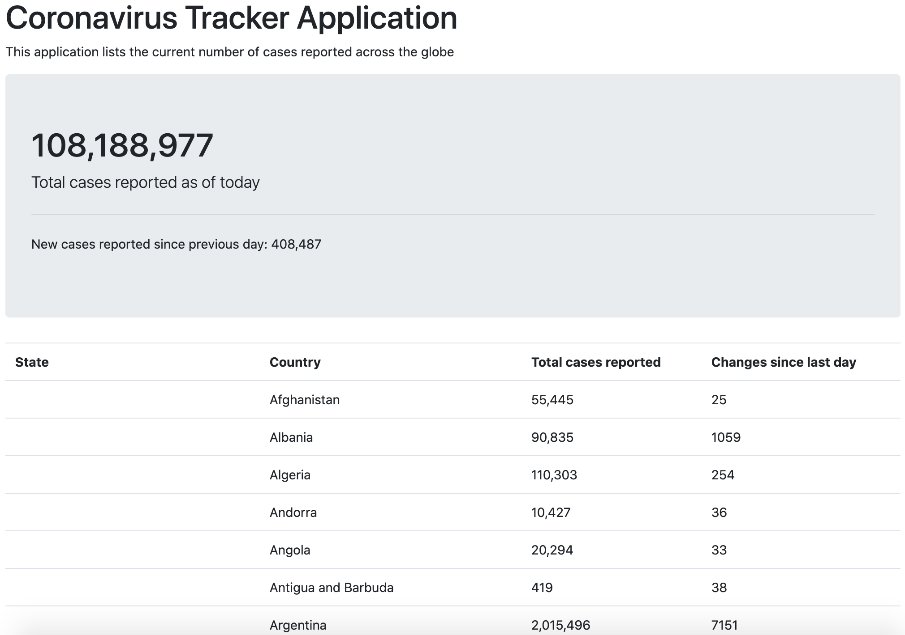

# Getting Started

### Introduction
One day project to ingest Coronavirus statistics and plot the results into a webpage.

### Reference Documentation
Dataset:
I'm using the data repository for the 2019 Novel Coronavirus Visual Dashboard operated by the Johns Hopkins University Center for Systems Science and Engineering (JHU CSSE). Also, Supported by ESRI Living Atlas Team and the Johns Hopkins University Applied Physics Lab (JHU APL).
[COVID-19 Data Repository](https://github.com/CSSEGISandData/COVID-19)

The code stack is:
* Java 15
* Spring Web
* Spring Boot Web
* Spring Boot Thymeleaf
* Apache Commons CSV

For further reference, please consider the following sections:

* [Official Apache Maven documentation](https://maven.apache.org/guides/index.html)
* [Spring Boot Maven Plugin Reference Guide](https://docs.spring.io/spring-boot/docs/2.2.5.RELEASE/maven-plugin/)
* [Spring Web](https://docs.spring.io/spring-boot/docs/2.2.5.RELEASE/reference/htmlsingle/#boot-features-developing-web-applications)
* [Thymeleaf](https://docs.spring.io/spring-boot/docs/2.2.5.RELEASE/reference/htmlsingle/#boot-features-spring-mvc-template-engines)
* [Spring Boot DevTools](https://docs.spring.io/spring-boot/docs/2.2.5.RELEASE/reference/htmlsingle/#using-boot-devtools)

### Guides
The following guides illustrate how to use some features concretely:

* [Building a RESTful Web Service](https://spring.io/guides/gs/rest-service/)
* [Serving Web Content with Spring MVC](https://spring.io/guides/gs/serving-web-content/)
* [Building REST services with Spring](https://spring.io/guides/tutorials/bookmarks/)
* [Handling Form Submission](https://spring.io/guides/gs/handling-form-submission/)